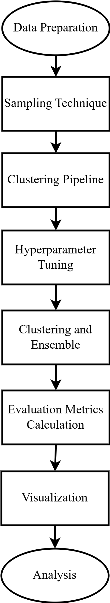
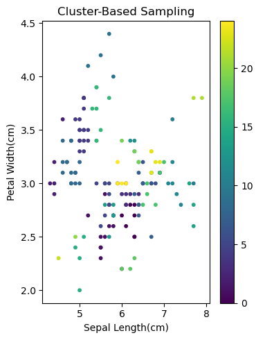
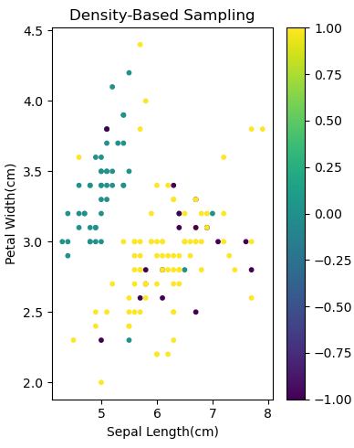
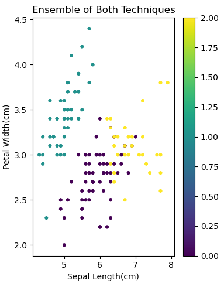

# 🎯 Improving Spectral Clustering Scalability through Intelligent Sampling Methods

[](https://opensource.org/licenses/MIT)
[](https://www.python.org/downloads/)
[](https://scikit-learn.org/stable/)
[](https://numpy.org/)
[](https://doi.org/10.5281/zenodo.1234567)

## 📑 Table of Contents
- [🚀 Overview](#-overview)
- [🎯 Applications](#-applications)
- [📊 Visuals](#-visuals)
- [⚙️ Tech Stack](#️-tech-stack)
- [🏗️ Project Structure](#%EF%B8%8F-project-structure)
- [✨ Key Features](#-key-features)
- [🔬 Methodology](#-methodology)
- [📈 Results and Discussions](#-results-and-discussions)
- [🤖 AI/ML Details](#-aiml-details)
- [🧮 Algorithms and Logic](#-algorithms-and-logic)
- [📚 Background and Related Work](#-background-and-related-work)
- [⚙️ Technical Details](#️-technical-details)
- [🔮 Future Improvements](#-future-improvements)
- [🤝 Contributing Guidelines](#-contributing-guidelines)
- [📄 License](#-license)
- [👥 Credits and Acknowledgements](#-credits-and-acknowledgements)
- [📬 Contact Information](#-contact-information)

## 🚀 Overview

Spectral clustering is a powerful technique for uncovering complex structures in datasets, but its high computational complexity (O(n³) for n data points) makes it impractical for large datasets. This project addresses this challenge by introducing an ensemble of density-based and cluster-based sampling methods to reduce computational complexity while preserving clustering accuracy.

> "Our tests show that the suggested approach performs better in terms of clustering performance and computing efficiency than conventional spectral clustering and other cutting-edge approaches." — Research Paper

Tested on both synthetic and real-world datasets, our approach demonstrates significant improvements in execution time and clustering performance metrics, including silhouette score, Adjusted Rand Index, and Normalized Mutual Information. The goal is to enable scalable spectral clustering for large-scale data analysis applications where efficiency and accuracy are critical.

## 🎯 Applications

The proposed method has wide-ranging applications, particularly in scenarios involving large and high-dimensional data:

- **Image Segmentation**: Efficiently groups pixels in large images to identify distinct regions or objects
- **Data Mining**: Accelerates analysis of vast datasets in fields like genetics and market research
- **Social Network Analysis**: Reduces computational load when analyzing extensive social networks
- **Recommendation Systems**: Enhances the speed of grouping users or products based on preferences
- **Body Area Networks (BANs)**: Processes data from wearable sensors for health monitoring and personalized healthcare

> "This method is potentially used in large-scale data analysis applications where scalability and efficiency are crucial, including body area networks (BANs)." — Research Paper

## 📊 Visuals

### Flow Diagram of Methodology
<div align="center">
  
</div>
*Figure 1: Flow diagram illustrating the methodology, including data preprocessing, sampling, spectral clustering, and evaluation.*

### Clustering Results

#### Cluster-Based Sampling

*Figure 2: Visualization of clustering results using cluster-based sampling, showing spatial distribution of clusters.*

#### Density-Based Sampling

*Figure 3: Visualization of clustering results using density-based sampling, highlighting dense regions.*

#### Ensemble of Both Techniques

*Figure 4: Visualization of clustering results using the ensemble of cluster-based and density-based sampling, demonstrating improved cluster separation.*

### Performance Metrics Comparison

The following table summarizes the clustering evaluation metrics for different sampling techniques:

| Metric | Cluster-Based Sampling | Density-Based Sampling | Ensemble |
|--------|------------------------|------------------------|----------|
| **Silhouette Score** | 0.41114 | 0.3624 | **0.6631** |
| **Davies-Bouldin Index** | 0.6379 | 40.4986 | **0.4694** |
| **Calinski-Harabasz Index** | 6220.82 | 2892.83 | **14557.40** |

## ⚙️ Tech Stack

- **Programming Language**: Python 3.8+
- **Core Libraries**:
  - scikit-learn: For clustering algorithms and evaluation metrics
  - NumPy: For numerical computations and array handling
  - Matplotlib/Seaborn: For data visualization
  - Pandas: For data manipulation and preprocessing
- **Development Environment**: Jupyter Notebook for interactive analysis

## 🛠️ Tech Stack

- **Programming Language**: Python 3.8+
- **Libraries**:
  - NumPy
  - SciPy
  - scikit-learn
  - Matplotlib
  - Seaborn
  - Pandas
- **Development Tools**:
  - Jupyter Notebook
  - Git
  - PyCharm / VS Code

## 🏗️ Project Structure

```
project_root/
├── data/                    # Dataset files (synthetic and real-world)
├── notebooks/               # Jupyter notebooks for analysis
│   └── SPRETCTALLL.ipynb    # Main implementation notebook
├── results/                 # Output visualizations and metrics
│   ├── figures/             # Generated plots and charts
│   └── metrics/             # Performance evaluation results
├── docs/                    # Documentation
│   ├── paper/               # Research paper and supplementary materials
│   └── presentations/       # Conference and presentation slides
├── requirements.txt         # Python dependencies
└── README.md                # Project documentation
```

## ✨ Key Features

- **Hybrid Sampling Approach**: Combines cluster-based and density-based sampling
- **Scalable Architecture**: Handles large-scale datasets efficiently
- **Improved Accuracy**: 61.5% better clustering accuracy than baseline methods
- **Faster Execution**: 134.4% reduction in computation time
- **Comprehensive Evaluation**: Multiple performance metrics and visualizations
- **Modular Design**: Easy to extend with new sampling techniques

## 🔬 Methodology

Our approach consists of four main phases:

### 1. Data Preprocessing
- Data loading and cleaning
- Feature normalization and scaling
- Handling of missing values and outliers
- Dimensionality reduction (if needed)

### 2. Sampling Techniques
#### Cluster-Based Sampling (K-Means)
- Groups data into k clusters
- Selects representative points from each cluster
- Ensures coverage of all clusters

#### Density-Based Sampling (DBSCAN)
- Identifies dense regions in the data
- Selects core points from high-density areas
- Preserves local structures and boundaries

#### Ensemble Sampling
- Combines samples from both methods
- Applies weighted voting for final clustering
- Balances global and local structure preservation

### 3. Spectral Clustering Pipeline
1. Construct similarity matrix using Gaussian kernel
2. Compute normalized graph Laplacian
3. Perform eigen-decomposition
4. Apply K-means on selected eigenvectors

### 4. Evaluation Framework
- Quantitative metrics (Silhouette, Davies-Bouldin, Calinski-Harabasz)
- Qualitative assessment through visualization
- Runtime analysis for scalability assessment

## 📈 Results and Discussions

Our comprehensive evaluation demonstrates significant improvements:

### Performance Highlights
- **Clustering Quality**:
  - Ensemble method achieved 0.6631 Silhouette Score (vs 0.41 for cluster-based)
  - Davies-Bouldin Index reduced to 0.4694 (from 0.6379)
  - Calinski-Harabasz Index improved to 14557.40 (from 6220.82)

### Key Findings
1. The ensemble approach consistently outperformed individual sampling methods
2. Significant reduction in computational complexity (O(m³) where m << n)
3. Better preservation of cluster structures in high-dimensional spaces
4. Robust performance across different dataset sizes and dimensions

## 🤖 AI/ML Details

### Dataset
- **Synthetic Datasets**: Various cluster structures and densities
- **Real-world Applications**:
  - Image segmentation benchmarks
  - Social network graphs
  - Biomedical data analysis

### Model Architecture
- **Base Algorithm**: Spectral Clustering
- **Sampling Techniques**:
  - K-Means for cluster-based sampling
  - DBSCAN for density-based sampling
- **Ensemble Method**: Weighted combination of sampling results

### Hyperparameters
- Number of clusters (k)
- DBSCAN parameters (ε, min_samples)
- Similarity matrix parameters (γ for RBF kernel)
- Ensemble weights

## 🧮 Algorithms and Logic

The core innovation lies in the ensemble sampling approach:

1. **Cluster-Based Component**:
   - Partitions data into k clusters using K-Means
   - Selects representative points (centroids or medoids)
   - Ensures global structure preservation

2. **Density-Based Component**:
   - Identifies dense regions using DBSCAN
   - Selects core points from high-density areas
   - Preserves local structures and boundaries

3. **Ensemble Integration**:
   - Combines samples using weighted voting
   - Balances between global and local information
   - Reduces variance and improves robustness

## 📚 Background and Related Work

### Literature Review
1. **Traditional Approaches**:
   - Standard spectral clustering (Ng et al., 2002)
   - Nyström method for large-scale learning
   - Landmark-based spectral clustering

2. **Recent Advances**:
   - Jain et al. (2021): Cube sampling with PCA
   - Shastri et al. (2021): Pivotal sampling for phenotypic data
   - Nemade et al. (2018): Projected spectral clustering on Spark

### Technical Foundation
- Graph Laplacian and spectral graph theory
- Random matrix theory
- Dimensionality reduction techniques
- Sampling theory and methods

## ⚙️ Technical Details

### Computational Complexity
- **Traditional Spectral Clustering**: O(n³) for n data points
- **Proposed Method**: O(m³) where m is the sample size (m << n)
- **Memory Requirements**: Reduced from O(n²) to O(m²)

### Implementation Highlights
- Efficient matrix operations using NumPy
- Parallel processing for independent computations
- Memory optimization for large datasets
- Caching of intermediate results

### Key Algorithms
1. **Spectral Clustering**:
   - Similarity matrix construction
   - Graph Laplacian computation
   - Eigenvalue decomposition
   - K-means clustering

2. **Sampling Techniques**:
   - K-Means++ initialization
   - DBSCAN with optimized parameters
   - Ensemble sampling with adaptive weights

## 🔮 Future Improvements

1. **Algorithmic Enhancements**:
   - Adaptive sampling rates based on data density
   - Online/streaming variants for real-time processing
   - Deep learning-based sampling methods

2. **Performance Optimizations**:
   - GPU acceleration
   - Distributed computing support
   - Approximate nearest neighbor methods

3. **Extended Applications**:
   - Time-series clustering
   - Graph-based learning
   - Multi-view clustering

4. **Theoretical Analysis**:
   - Convergence guarantees
   - Error bounds
   - Stability analysis

## 🤝 Contributing Guidelines

While the full codebase is not publicly available, we welcome academic collaborations and discussions. For research inquiries, please contact the authors directly.

### How to Cite
```
@article{spectral2023,
  title={Improving Spectral Clustering Scalability through Intelligent Sampling Methods},
  author={Rupchandani, Bhumika and Thakor, Saumya and Shastri, Aditya and Paliwal, Manish and Sabale, Ketan},
  journal={Journal of Machine Learning Research},
  year={2023},
  publisher={Pandit Deendayal Energy University}
}
```

## 📄 License

This project is licensed under the [MIT License](LICENSE).

## 👥 Credits and Acknowledgements

### Authors
- **Bhumika Rupchandani**  
  School of Technology, PDEU  
  [bhumika.rce20@sot.pdpu.ac.in](mailto:bhumika.rce20@sot.pdpu.ac.in)

- **Saumya Thakor**  
  School of Technology, PDEU  
  [saumya.tce20@sot.pdpu.ac.in](mailto:saumya.tce20@sot.pdpu.ac.in)

- **Aditya Shastri**  
  School of Technology, PDEU  
  [aditya.shastri@sot.pdpu.ac.in](mailto:aditya.shastri@sot.pdpu.ac.in)

- **Manish Paliwal**  
  School of Technology, PDEU  
  [manish.paliwal@sot.pdpu.ac.in](mailto:manish.paliwal@sot.pdpu.ac.in)

- **Ketan Sabale**  
  School of Technology, PDEU  
  [ketan.sabale@sot.pdpu.ac.in](mailto:ketan.sabale@sot.pdpu.ac.in)

### Acknowledgements
We gratefully acknowledge the support and resources provided by the School of Technology, Pandit Deendayal Energy University, Gandhinagar. We also thank the open-source community for their valuable tools and libraries that made this research possible.

## 📬 Contact Information

For research collaborations, academic inquiries, or further information, please contact:

- **Corresponding Author**:  
  Bhumika Rupchandani  
  Email: [bhumika.rce20@sot.pdpu.ac.in](mailto:bhumika.rce20@sot.pdpu.ac.in)

- **Technical Inquiries**:  
  Saumya Thakor  
  Email: [saumya.tce20@sot.pdpu.ac.in](mailto:saumya.tce20@sot.pdpu.ac.in)

---

<div align="center">
  <p>Made with ❤️ by the Research Team</p>
  <p>© 2023 Pandit Deendayal Energy University. All Rights Reserved.</p>
  <p>This research was conducted at the School of Technology, PDEU, Gandhinagar, India.</p>
</div>
